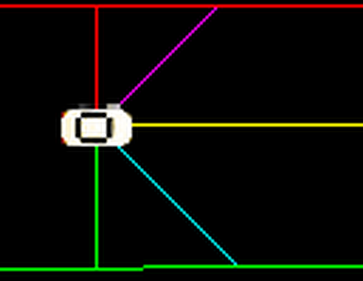
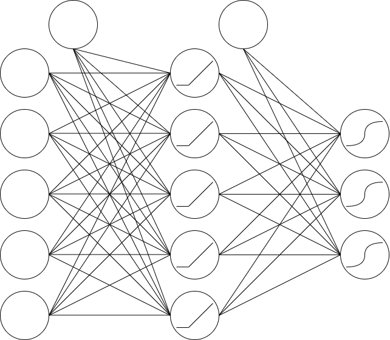

## Evolving race cars ##
Cars learn to drive on a custom made track using Neural Network and Genetic Algorithm. Each car has their respective "brain" where the weights are randomly initialised in the beginning. As for the input each car has a set of 5 sensors which measure the distance to the surrounding track walls. 

These sensors are then fed to the neural network and make a decision based on this input. Decision output can be to drive forward and turn left/right.

### Genetic Algorithm ###
When a car collides with the wall or does not move for 4 seconds, it dies and its fitness is evaluated based on how far it has travelled and how many checkpoints it has passed, which have been manually added to the track. Each generation fit and unfit individuals are selected as parents based on [Roulette Wheel Selection](https://en.wikipedia.org/wiki/Fitness_proportionate_selection) on which crossover is applied. Hereby randomly chosen weights from Parent _A_ and Parent _B_ form the new neural network for the offspring. Random mutation is applied to each individual to keep diversity in the population and avoid local optimums.

### Demo ###
